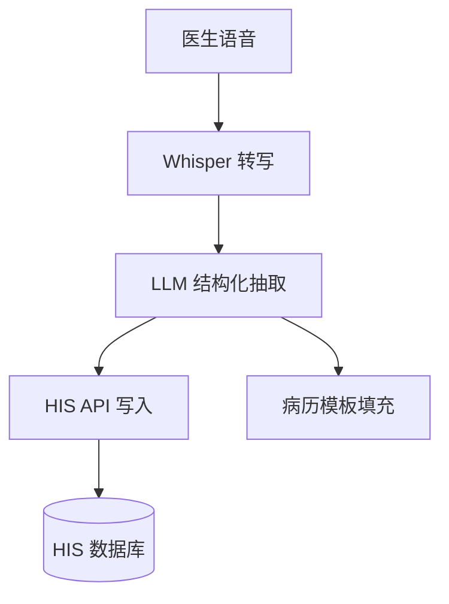

# FDE 全流程演示：医疗诊所病历录入自动化

> 展示 fde-cli 如何端到端执行一个企业 AI 落地项目。

---

## 项目背景

**客户**: 某社区诊所（15名医生，3个分院）
**目标**: 用 AI 优化病历录入流程，减少医生文书时间
**痛点**: 医生日均花 73 分钟在病历模板填写上，患者等待时间长

---

## Agent 执行记录

### Phase 1: 现场发现

```bash
fde new --client "某社区诊所" --industry "医疗" --project "病历录入AI优化"
```

**输出**: `01-fde-discovery.md`

| ID | 类别 | 描述 | 频率 | 影响 |
|:--|:----|:----|:---:|:---:|
| P1 | 效率 | 病历模板重复填写 | ★★★★★ | ★★★★ |
| P2 | 数据 | HIS 系统操作步骤多 | ★★★★ | ★★★★ |
| P3 | 质量 | 手写录入易出错 | ★★★ | ★★★★★ |

---

### Phase 2: 差距评估

`time-audit` 集成扫描结果（对接 Screenpipe 后）：

| ID | 层级 | 描述 | 置信度 | 难度 | 周节省 | ROI 口径 |
|:--|:---|:----|:-----|:----|:------|:----|
| L-01 | line | 病历模板填写 (time-audit 记录每日3-5次, 约14分钟/次) | high | low | 350分钟 | 真实审计数据 |
| L-02 | line | HIS 登录→查询→导出流程 | high | med | 120分钟 | 真实审计数据 |
| P-03 | point | 重复录入患者基本信息 | med | low | 需客户数据 | 待验证 |

**ROI 汇总**: 已知周节省合计 470分钟/医生；团队级收益需用排班和实际采纳率复核。

---

### Phase 3: 架构设计

**核心方案**: 语音录入 → Whisper 转写 → LLM 结构化抽取 → HIS API 写入



**技术栈**: Whisper + Ollama(qwen2.5:14b) + Python + HIS REST API

---

### Phase 4: 原型计划

**输出**: `~/Desktop/fde-prototype-eng-xxxx/`

```
fde-prototype-eng-xxxx/
├── speech_to_text.py     ← 语音转写模块
├── medical_ner.py        ← 医疗实体抽取
├── his_client.py         ← HIS API 客户端
├── template_filler.py    ← 病历模板填充
├── requirements.txt
├── tests/
└── README.md
```

---

### Phase 5: 交付交接

**输出**: `05-fde-handoff.md`

| 文档 | 内容摘要 |
|:---|:--------|
| 系统架构 | 语音录入 → HIS 写入 全链路 |
| 部署步骤 | Ollama + Python + HIS 配置 |
| 运维指南 | 模型热更新、日志、故障恢复 |
| 决策记录 | 选用 Whisper 而非云端 API（隐私原因）|

**后续建议**:
- 2周后回访评估采纳率
- 第二阶段扩展到检查单自动填充
- 考虑与药房系统对接

---

## 用户直接可用性检查 ✅

- [x] 交付目录在 `~/Desktop/fde-engagements/eng-xxxx/`
- [x] 5份完整 Markdown 交付文档
- [x] 原型计划在 `~/Desktop/fde-engagements/eng-xxxx/04-fde-prototype.md`
- [x] 交接文档含运维指南
- [x] 用户拿到即可找开发搭建
